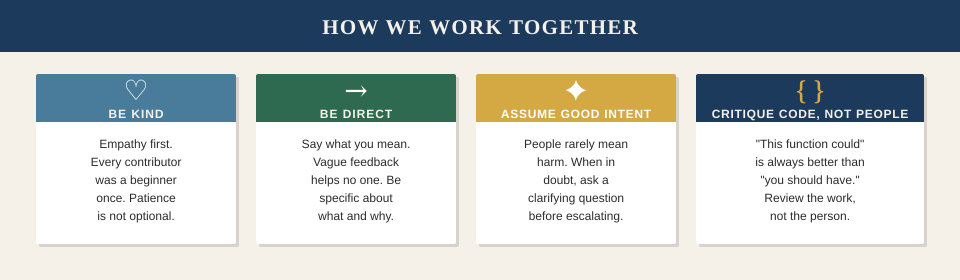

# Code of Conduct

Every person who participates in Engram — filing issues, reviewing code, asking questions, writing documentation — deserves to be treated with basic decency. This document describes what that looks like in practice.

---

  

---

## What We're Going For

The goal is a community where people can do good technical work without navigating social friction. That means:

- **You can ask a question without being made to feel stupid for not knowing the answer.** Everyone was a beginner once. A good community accelerates learning; it doesn't punish the absence of experience.

- **You can disagree without it becoming personal.** Technical disagreements are normal and healthy. Personal attacks are not. "This approach has a race condition in the edge case where X" is technical. "You clearly don't understand concurrent programming" is personal. One is useful; the other isn't.

- **You get honest feedback.** Being kind doesn't mean being vague. "This looks good" when it doesn't is not helpful. "This will break under concurrent access — here's why and here's a fix" is both honest and kind.

- **You can make mistakes.** Mistakes are how everyone learns. A project where people are afraid to be wrong stops attracting the kind of contributors who try things.

---

## Our Standards

**Behavior that makes this work:**

- Empathy toward people at different experience levels
- Specific, actionable feedback that helps people improve
- Accepting feedback gracefully — it's about the code, not about you
- Taking responsibility when you get something wrong
- Focusing on what's best for the project, not winning arguments

**Behavior that doesn't:**

- Harassment of any kind — public or private
- Demeaning comments about experience level, background, identity, or anything else unrelated to the work
- Personal or political attacks
- Publishing someone's private information without their permission
- Sexualized language, imagery, or attention
- Sustained disruption of discussions
- Any conduct that would be unacceptable in a professional setting

The list above isn't exhaustive. The underlying principle is: treat people the way you'd want to be treated if you were new to the project and trying to contribute something useful.

---

## Scope

This Code of Conduct applies everywhere Engram community members interact — GitHub issues, pull requests, code review comments, and any other forum where someone is acting as a representative of the project or its community.

It applies to the maintainers too. Nobody is exempt.

---

## Enforcement

If you experience or witness behavior that violates this Code of Conduct, please report it. All complaints are reviewed and investigated promptly, confidentially, and fairly.

**How to report:**

1. Open a GitHub Security Advisory (use the "Report a vulnerability" path) with the title `[CONDUCT]` — this keeps your report private from other users
2. Or contact the maintainers directly via the contact listed in the repository

What happens after a report:
- All reports are taken seriously
- Reports are kept confidential — the identity of the reporter is not shared without explicit permission
- Maintainers will investigate and determine an appropriate response, which may include removing content, issuing a warning, or removing a participant from the project

The primary goal of enforcement is to maintain a community where everyone can participate. It is not punitive for its own sake.

---

## Attribution

This Code of Conduct draws from the [Contributor Covenant](https://www.contributor-covenant.org), version 2.1. The framing and emphasis reflect what this project's maintainers actually care about.

If you have a question about this document or how it applies in a specific situation, open an issue. Edge cases are worth discussing openly.
