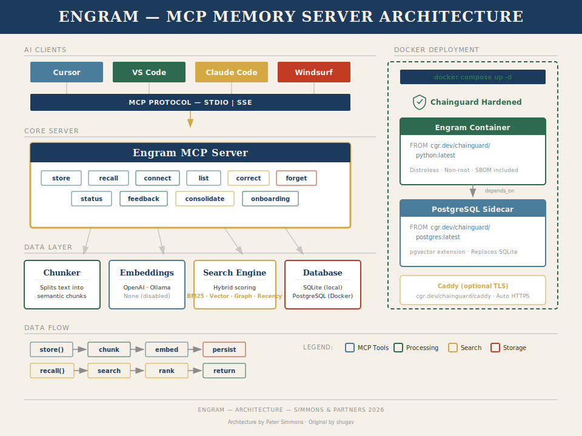
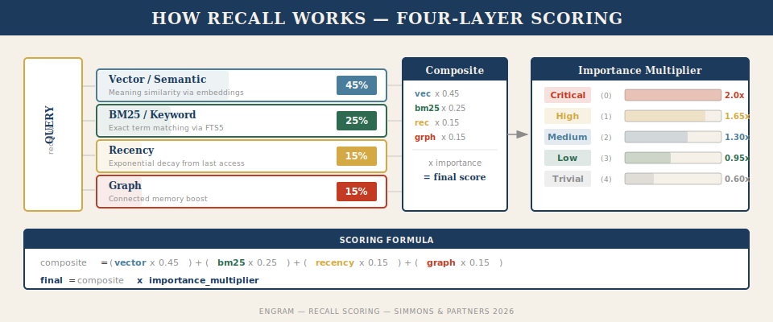

# Engram

[](https://www.python.org/)
[](LICENSE)
[](https://modelcontextprotocol.io/)
[](https://github.com/shugav/engram)

**Your AI agents forget everything between sessions. Engram fixes that.**

Close a tab in Cursor, Claude Code, or VS Code, and your agent loses every
decision it made, every bug it found, every bit of architecture it mapped. Next
session starts from zero. You re-explain. The agent re-discovers the same
gotchas. Both of you waste time.

Engram is a persistent memory server for AI agents. It speaks
[MCP](https://modelcontextprotocol.io/), stores everything in a local SQLite
file you own, and searches it four ways — keyword match, semantic similarity,
knowledge graph, and recency. Search for "database lock contention" and it finds
the memory you stored about "WAL mode busy timeout." No cloud service. No
subscription. One Python process, one database file, your disk.

When one agent stores a decision, the next agent finds it. Switch from Cursor to
Claude Code — the context follows. Three agents on the same project share what
they learn, like coworkers leaving notes on a whiteboard that remembers
everything and finds the right note before you ask.

> **Beta software.** Engram is under active development by
> [shugav](https://github.com/shugav). APIs, storage format, and behavior may
> change between releases. See [LICENSE](LICENSE) for the full warranty
> disclaimer.

---

## What's Inside

Engram runs as a local MCP server and exposes ten tools any MCP client can call:

| Tool                   | What it does                                                    |
|------------------------|-----------------------------------------------------------------|
| `memory_store`         | Save a memory — auto-chunks, embeds, and indexes it             |
| `memory_recall`        | Search across all three layers with a single query              |
| `memory_list`          | Browse recent memories with type/tag/importance filters         |
| `memory_correct`       | Supersede a wrong or outdated memory with a corrected version   |
| `memory_forget`        | Delete a memory and all its graph connections                   |
| `memory_connect`       | Link two memories with a typed relationship                     |
| `memory_feedback`      | Tell the system which recall results were actually useful       |
| `memory_consolidate`   | Deduplicate, decay weak links, prune stale memories             |
| `memory_status`        | View stats: memory count, chunks, graph size, DB size           |
| `onboarding`           | Get a project-specific quick-start guide for new sessions       |

Engram organizes memories by **project** — each project gets its own database
file. Your web app memories don't leak into your CLI tool's context. Store
user-wide preferences in `project="global"` so every project can find them.

---

## Architecture

<p align="center">
  
</p>

### The Three Layers

Engram blends four signals into one score. This means recall works whether you
remember the exact error code or just the shape of the problem:

<p align="center">
  
</p>

**1. BM25 Keyword Search** — SQLite FTS5 with Porter stemming. Search for
"SQLITE_BUSY timeout" and it finds the exact phrase. Fast, precise, no external
dependencies.

**2. Vector Semantic Search** — Optional embedding-based similarity. Search for
"database lock contention" when the stored memory says "WAL mode busy timeout" —
the vectors connect the meaning even though the words differ. Supports OpenAI,
Ollama (local/free), or disabled entirely.

**3. Recency Decay** — Recently touched memories score higher. Exponential decay
at 1% per hour means today's context outweighs last month's, but nothing
vanishes — it just gets quieter.

**4. Knowledge Graph** — Memories linked by typed relationships (`depends_on`,
`supersedes`, `caused_by`, `relates_to`, `used_in`, `resolved_by`) get a
connectivity boost. Recall one memory and its neighbors come along. Over time,
`memory_feedback` strengthens useful connections and weakens noise — the graph
learns what matters.

The final score:

```
composite = (vector × 0.45) + (bm25 × 0.25) + (recency × 0.15) + (graph × 0.15)
final     = composite × importance_multiplier
```

Critical memories (importance 0) get a 2× boost. Trivial ones (importance 4) get
0.6×. The system self-maintains: `memory_consolidate` decays unused graph edges,
deduplicates chunks, and prunes low-importance memories nobody has touched in 30
days.

---

## Memory Types

Six typed categories let agents filter by context:

| Type             | When to use it                                           | Example                                                      |
|------------------|----------------------------------------------------------|--------------------------------------------------------------|
| `decision`       | Choices and their reasoning                              | "Chose PostgreSQL over MySQL because of JSON column support"  |
| `pattern`        | Recurring code or architecture patterns                  | "This codebase uses the repository pattern for all DB access" |
| `error`          | Bugs, gotchas, and their fixes                           | "Port 3000 is taken on this server — use 3001 instead"        |
| `context`        | General project or environment details                   | "Running on Ubuntu 22.04 with Python 3.11"                    |
| `architecture`   | System design, data flow, integrations                   | "Auth flow: JWT → middleware → httpOnly cookie"               |
| `preference`     | User conventions and style preferences                   | "User prefers tabs, 120-char line length, no trailing commas" |

---

## Embedding Options

You choose the quality/cost/privacy tradeoff. Engram auto-detects the best
available option, or you can force one:

| Mode       | Model                        | Dimensions | Quality     | Cost     | Privacy     |
|------------|------------------------------|------------|-------------|----------|-------------|
| **OpenAI** | `text-embedding-3-small`     | 1536       | Highest     | ~$0.02/M | Cloud       |
| **Ollama** | `nomic-embed-text`           | 768        | Good        | Free     | Fully local |
| **None**   | —                            | —          | BM25 only   | Free     | Fully local |

Without embeddings, you still get keyword search, recency scoring, and the full
knowledge graph. Vector search adds the "I know what you mean even when you use
the wrong words" layer.

> **Lock-in protection:** Once a project stores its first embedding, Engram
> records the model name and dimensions. If you switch models, it refuses to
> mix incompatible vectors rather than silently corrupting your search results.

---

## Quick Start

### Prerequisites

- Python 3.11 or newer
- Git
- *(Optional)* An OpenAI API key, or [Ollama](https://ollama.com) with
  `nomic-embed-text` pulled

### Install

```bash
git clone https://github.com/shugav/engram.git
cd engram
python3 -m venv .venv
source .venv/bin/activate
pip install -e .
```

No Docker. No database to provision. No config files. Engram creates its SQLite
databases on first use at `~/.engram/`.

### Configure Embeddings (Optional)

```bash
# Option A: OpenAI (highest quality, costs money)
export OPENAI_API_KEY="sk-..."

# Option B: Ollama (good quality, free, fully local)
# Install from https://ollama.com, then:
ollama pull nomic-embed-text

# Option C: Do nothing — Engram falls back to BM25-only mode automatically
```

### Connect Your IDE

#### Cursor / VS Code (local, same machine)

Add to `~/.cursor/mcp.json`:

```json
{
  "mcpServers": {
    "engram": {
      "command": "/path/to/engram/.venv/bin/python",
      "args": ["-m", "engram"],
      "env": {
        "OPENAI_API_KEY": "sk-...",
        "PYTHONPATH": "/path/to/engram/src"
      }
    }
  }
}
```

Replace `/path/to/engram` with your actual clone path. Restart Cursor. Engram
starts as a subprocess — no server to manage.

#### Claude Code

```bash
claude mcp add engram -- /path/to/engram/.venv/bin/python -m engram
```

#### Network Mode (SSE) — Multiple Machines

Start the server on one machine:

```bash
python -m engram --transport sse --port 8788
```

Point any client at it:

```json
{
  "mcpServers": {
    "engram": {
      "url": "http://your-server:8788/sse"
    }
  }
}
```

Or use the setup script to auto-configure a remote Cursor instance:

```bash
bash setup-remote.sh your-server 8788
```

---

## Environment Variables

| Variable           | Default                   | What it does                                       |
|--------------------|---------------------------|----------------------------------------------------|
| `ENGRAM_EMBEDDER`  | *(auto-detect)*           | Force embedding mode: `openai`, `ollama`, or `none` |
| `OPENAI_API_KEY`   | *(unset)*                 | OpenAI key for vector embeddings                   |
| `OLLAMA_URL`       | `http://localhost:11434`  | Ollama server address (if non-default)             |
| `ENGRAM_PROJECT`   | `default`                 | Default project namespace                          |
| `ENGRAM_DIR`       | `~/.engram/`              | Where database files live                          |
| `ENGRAM_API_KEY`   | *(unset)*                 | Bearer token for SSE authentication                |

---

## Security

Engram stores data on your filesystem. Here's what you should know.

**Local (stdio) mode** is the default and the safest. Engram runs as a
subprocess of your IDE. No network port opens. Data stays on your machine. The
attack surface matches any other CLI tool you run locally.

**Network (SSE) mode** opens an HTTP endpoint. If you run it:

- **Set an API key.** Without one, anyone on your network can read and write your
  memories. Use `--api-key` or `ENGRAM_API_KEY`.
- **Use TLS in production.** The API key travels as a Bearer token over HTTP.
  Without TLS, anyone between you and the server can read it. Put a reverse proxy
  (Caddy, Nginx) in front for HTTPS.
- **Bind to localhost** unless you need network access: `--host 127.0.0.1`. On a
  trusted mesh VPN like Tailscale, binding to your Tailscale IP is reasonable.

**What Engram stores:** Memory text, embedding vectors (opaque float arrays), and
a knowledge graph (relationship metadata). All of it lives in `~/.engram/*.db`
SQLite files. Engram sends no data anywhere unless you configure OpenAI
embeddings — then your memory text goes to OpenAI's embedding API. Use Ollama or
`none` mode if that concerns you.

For responsible disclosure of security issues, see [SECURITY.md](SECURITY.md).

---

## How Agents Use It

Engram ships with a built-in system prompt (the `onboarding` tool) that teaches
agents the full workflow. The short version:

**Session start** — The agent calls `memory_recall("session handoff")` to pick up
where the last agent left off.

**During work** — When the agent makes a decision, hits a bug, or spots a
pattern, it stores a memory. Typed, tagged, with an importance level.

**Session end** — The agent stores a handoff note: what it did, what's next,
what's blocked, which files changed. The next agent reads this and picks up
without missing a step.

**Over time** — Feedback strengthens useful connections. Consolidation prunes the
noise. The memory gets sharper the more you use it.

---

## Database Layout

Each project gets its own SQLite file at `~/.engram/{project}.db`.

| Table             | Purpose                                                         |
|-------------------|-----------------------------------------------------------------|
| `memories`        | Memory records with content, type, tags, importance, timestamps |
| `memory_fts`      | FTS5 full-text index (Porter stemming, Unicode)                 |
| `chunks`          | Chunked text with embedding BLOBs and dedup hashes              |
| `relationships`   | Typed directed graph edges with decay-capable strength values    |
| `project_meta`    | Metadata: embedding model name, dimensions, schema version      |

WAL mode is on for better read concurrency. Each database is self-contained —
back it up by copying the `.db` file, or move it to another machine.

---

## Scaling

| Deployment     | Agents   | How it works                                                                    |
|----------------|----------|---------------------------------------------------------------------------------|
| **stdio**      | 1 per machine | IDE spawns engram as a subprocess. Simplest setup.                        |
| **SSE**        | Many     | One central server, many agent clients over HTTP. All writes serialize through one process. |

**Known limit:** SQLite is single-writer. In SSE mode, one server process
handles all writes in series — fine for typical agent workloads, but it won't
scale to hundreds of concurrent writers. A PostgreSQL backend is planned for true
multi-process concurrency.

---

## Uninstall

Engram leaves a small footprint and cleans up fast.

### Remove the Code

```bash
# If installed with pip
pip uninstall engram

# If cloned manually
rm -rf /path/to/engram
```

### Remove Your Data

All databases live in one directory:

```bash
rm -rf ~/.engram
```

That's everything. No background processes, no system services, no config files
scattered across your system. If you used the `engram.sh` launcher via SSH,
removing the clone directory handles it.

### Remove IDE Configuration

Delete the `engram` entry from your MCP config:

- **Cursor/VS Code:** `~/.cursor/mcp.json` → remove the `"engram"` key
- **Claude Code:** `claude mcp remove engram`

---

## Compatible Clients

Engram works with any MCP-compatible client:

- [Cursor](https://cursor.sh)
- [VS Code](https://code.visualstudio.com/) (Copilot MCP support)
- [Claude Desktop](https://claude.ai)
- [Claude Code](https://github.com/anthropics/claude-code)
- [Windsurf](https://codeium.com/windsurf)

---

## Contributing

Contributions welcome — first-time contributors especially. See
[CONTRIBUTING.md](CONTRIBUTING.md) for setup and workflow.

For security issues, see [SECURITY.md](SECURITY.md).

---

## License

MIT License. See [LICENSE](LICENSE).

---

<sub>Engram was created by [shugav](https://github.com/shugav). Security review
and documentation by [Peter Simmons](mailto:petersimmons@duck.com). README
drafted by Claude (Anthropic), revised by George Orwell's ghost — who would have
hated every word of this but couldn't resist cutting the bad ones.</sub>
