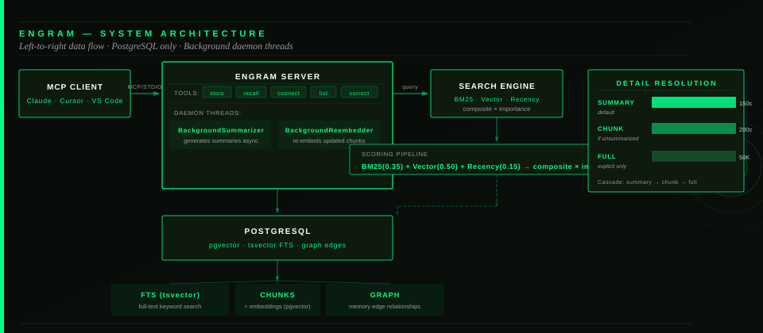
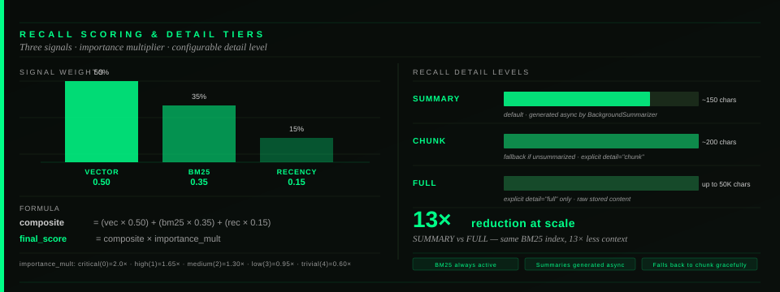

# Engram

[](https://www.python.org/)
[](LICENSE)
[](https://modelcontextprotocol.io/)
[](https://github.com/shugav/engram)

**Your AI agents forget everything between sessions. Engram fixes that.**

Close a tab in Cursor, Claude Code, or VS Code, and your agent loses every decision it made, every bug it found, every bit of architecture it mapped. Next session starts from zero. You re-explain. The agent re-discovers the same gotchas. Both of you waste time.

Engram is a persistent memory server for AI agents. It speaks [MCP](https://modelcontextprotocol.io/), stores everything in a database you own, and searches it four ways — keyword match, semantic similarity, knowledge graph, and recency. Search for "database lock contention" and it finds the memory you stored about "WAL mode busy timeout." No cloud service. No subscription. Run it locally with SQLite, or deploy with Docker and PostgreSQL.

When one agent stores a decision, the next agent finds it. Switch from Cursor to Claude Code — the context follows. Three agents on the same project share what they learn, like coworkers leaving notes on a whiteboard that remembers everything and finds the right note before you ask.

**Most importantly: You own your data. You can export it, back it up, or walk away with it in plain markdown. No lock-in.**

> **Beta software.** Engram is under active development. APIs, storage format, and behavior may change between releases. See [LICENSE](LICENSE) for the full warranty disclaimer.

---

## What's Inside

Engram exposes twelve tools any MCP client can call:

### Core Memory Operations

| Tool                   | What it does                                                    |
|------------------------|-----------------------------------------------------------------|
| `memory_store`         | Save a memory — auto-chunks, embeds, and indexes it             |
| `memory_recall`        | Search across all three layers with a single query              |
| `memory_list`          | Browse recent memories with type/tag/importance filters         |
| `memory_correct`       | Supersede a wrong or outdated memory with a corrected version   |
| `memory_forget`        | Delete a memory and all its graph connections                   |
| `memory_connect`       | Link two memories with a typed relationship                     |
| `memory_feedback`      | Tell the system which recall results were actually useful       |
| `memory_consolidate`   | Deduplicate, decay weak links, prune stale memories             |
| `memory_status`        | View stats: memory count, chunks, graph size, DB size           |
| `onboarding`           | Get a project-specific quick-start guide for new sessions       |

### Data Portability (Install/Uninstall)

| Tool                   | What it does                                                    |
|------------------------|-----------------------------------------------------------------|
| `memory_dump`          | Export all project memories as markdown files                   |
| `memory_ingest`        | Import markdown files as memories + create backup snapshot      |

Engram organizes memories by **project** — each project gets its own namespace. Your web app memories don't leak into your CLI tool's context. Store user-wide preferences in `project="global"` so every project can find them.

---

## Architecture

<p align="center">
  
</p>

### The Three Layers

Engram blends four signals into one score. This means recall works whether you remember the exact error code or just the shape of the problem:

<p align="center">
  
</p>

**1. BM25 Keyword Search** — Full-text search with Porter stemming (FTS5 in SQLite, tsvector in PostgreSQL). Search for "SQLITE_BUSY timeout" and it finds the exact phrase. Fast, precise, no external dependencies.

**2. Vector Semantic Search** — Optional embedding-based similarity. Search for "database lock contention" when the stored memory says "WAL mode busy timeout" — the vectors connect the meaning even though the words differ. Supports OpenAI, Ollama (local/free), or disabled entirely.

**3. Recency Decay** — Recently touched memories score higher. Exponential decay at 1% per hour means today's context outweighs last month's, but nothing vanishes — it just gets quieter.

**4. Knowledge Graph** — Memories linked by typed relationships (`depends_on`, `supersedes`, `caused_by`, `relates_to`, `used_in`, `resolved_by`) get a connectivity boost. Recall one memory and its neighbors come along. Over time, `memory_feedback` strengthens useful connections and weakens noise — the graph learns what matters.

The final score:

```
composite = (vector × 0.45) + (bm25 × 0.25) + (recency × 0.15) + (graph × 0.15)
final     = composite × importance_multiplier
```

Critical memories (importance 0) get a 2× boost. Trivial ones (importance 4) get 0.6×. The system self-maintains: `memory_consolidate` decays unused graph edges, deduplicates chunks, and prunes low-importance memories nobody has touched in 30 days.

---

## Memory Types

Six typed categories let agents filter by context:

| Type             | When to use it                                           | Example                                                      |
|------------------|----------------------------------------------------------|--------------------------------------------------------------|
| `decision`       | Choices and their reasoning                              | "Chose PostgreSQL over MySQL because of JSON column support"  |
| `pattern`        | Recurring code or architecture patterns                  | "This codebase uses the repository pattern for all DB access" |
| `error`          | Bugs, gotchas, and their fixes                           | "Port 3000 is taken on this server — use 3001 instead"        |
| `context`        | General project or environment details                   | "Running on Ubuntu 22.04 with Python 3.11"                    |
| `architecture`   | System design, data flow, integrations                   | "Auth flow: JWT → middleware → httpOnly cookie"               |
| `preference`     | User conventions and style preferences                   | "User prefers tabs, 120-char line length, no trailing commas" |

---

## Embedding Options

You choose the quality/cost/privacy tradeoff. Engram auto-detects the best available option, or you can force one:

| Mode       | Model                        | Dimensions | Quality     | Cost     | Privacy     |
|------------|------------------------------|------------|-------------|----------|-------------|
| **OpenAI** | `text-embedding-3-small`     | 1536       | Highest     | ~$0.02/M | Cloud       |
| **Ollama** | `nomic-embed-text`           | 768        | Good        | Free     | Fully local |
| **None**   | —                            | —          | BM25 only   | Free     | Fully local |

Without embeddings, you still get keyword search, recency scoring, and the full knowledge graph. Vector search adds the "I know what you mean even when you use the wrong words" layer.

> **Lock-in protection:** Once a project stores its first embedding, Engram records the model name and dimensions. If you switch models, it refuses to mix incompatible vectors rather than silently corrupting your search results.

---

## Installation

Engram runs exclusively via Docker and Compose. A standard installation starts four required services:

1. **PostgreSQL** — Persistent database (Docker volume: `pgdata`)
2. **Ollama** — Local embedding model (Docker volume: `ollama-data`)
3. **Open-WebUI** — Auth proxy for Ollama (port 3000)
4. **Engram** — MCP server (port 8788)

### Prerequisites

- Docker Engine 20.10+
- Docker Compose 2.0+
- 4 GB RAM minimum (8 GB recommended)
- For GPU acceleration: NVIDIA CUDA, AMD ROCm, or Mac M-series Metal support

### Quick Start

```bash
git clone https://github.com/shugav/engram.git
cd engram
docker compose up -d
```

This starts all four services. Engram listens on `http://localhost:8788/sse`.

> **First run?** Ollama needs to pull the embedding model. Run once to initialize:
> ```bash
> docker compose --profile init run --rm ollama-init
> ```
> This pulls `nomic-embed-text`. Future runs start faster.

### Open-WebUI Setup (First Boot)

Open-WebUI acts as an authenticated proxy between Engram and Ollama. Choose one of two setup methods:

#### Option A: Automatic (Headless)

Add these to your `.env` file **before first boot**:

```bash
WEBUI_ADMIN_EMAIL=admin@local.dev
WEBUI_ADMIN_PASSWORD=your-secure-password
WEBUI_SECRET_KEY=your-jwt-secret
```

Then generate an API key via the API:

```bash
# Sign in and get a JWT
TOKEN=$(curl -s http://localhost:3000/api/v1/auths/signin \
  -H "Content-Type: application/json" \
  -d '{"email":"admin@local.dev","password":"your-secure-password"}' \
  | jq -r '.token')

# Generate a persistent API key
curl -s http://localhost:3000/api/v1/auths/api_key \
  -H "Authorization: Bearer $TOKEN" -X POST | jq -r '.api_key'
```

Add the resulting `sk-...` key to your `.env`:

```bash
OLLAMA_API_KEY=sk-your-key-here
```

Then restart: `docker compose restart engram`

#### Option B: Browser

1. Open http://localhost:3000
2. Create an admin account (the first signup automatically becomes admin)
3. Go to **Settings > Account > API Keys**
4. Generate a new API key (starts with `sk-...`)
5. Add it to your `.env` file:
   ```bash
   OLLAMA_API_KEY=sk-your-key-here
   ```
6. Restart Engram to pick up the key:
   ```bash
   docker compose restart engram
   ```

### Configuration

Create a `.env` file in the engram directory for customization:

```bash
# .env (optional)
ENGRAM_API_KEY=your-secret-token              # For network authentication
ENGRAM_EMBEDDER=ollama                         # Auto-detected; force with: openai, ollama, none
OPENAI_API_KEY=sk-...                          # If using OpenAI embeddings
OLLAMA_API_KEY=sk-...                          # Open-WebUI API key for Ollama proxy auth
OLLAMA_URL=http://open-webui:8080/ollama       # Routes through Open-WebUI (default)
POSTGRES_PASSWORD=change-me-in-production      # Default: engram
ENGRAM_PORT=8788                               # HTTP port (default)
```

Restart the services after changing `.env`:

```bash
docker compose down && docker compose up -d
```

### GPU Configuration

By default, Ollama runs on CPU. For faster embeddings, add GPU support:

#### NVIDIA GPUs (CUDA)

```bash
docker compose -f docker-compose.yml -f docker-compose.nvidia.yml up -d
```

Requires:
- NVIDIA GPU with CUDA compute capability 3.5+
- NVIDIA Container Toolkit installed
- Docker daemon configured with `nvidia` runtime

#### AMD GPUs (ROCm)

```bash
docker compose -f docker-compose.yml -f docker-compose.amd.yml up -d
```

Requires:
- AMD RDNA or CDNA GPU
- ROCm runtime on host
- `rocm` image support

#### Mac M-series (Metal)

No override needed. Docker Desktop on Apple Silicon auto-detects Metal acceleration. Ollama uses Metal automatically.

#### System Ollama (Local/Host)

If you're running Ollama natively on your machine (not in Docker):

```bash
# Start your host Ollama
ollama serve

# In another terminal, init the model
ollama pull nomic-embed-text

# Start Engram pointing to host Ollama
docker compose -f docker-compose.yml -f docker-compose.host-ollama.yml up -d
```

### Connect Your IDE

Docker runs Engram in SSE mode. Point your IDE at the server:

#### Cursor / VS Code

Add to `~/.cursor/mcp.json`:

```json
{
  "mcpServers": {
    "engram": {
      "url": "http://localhost:8788/sse"
    }
  }
}
```

#### Claude Code

```bash
claude mcp add engram --transport sse http://localhost:8788/sse
```

#### Claude Desktop

Add to `~/Library/Application Support/Claude/claude_desktop_config.json` (macOS) or `%APPDATA%\Claude\claude_desktop_config.json` (Windows):

```json
{
  "mcpServers": {
    "engram": {
      "command": "docker",
      "args": ["exec", "-i", "engram-app", "python", "-m", "engram"],
      "disabled": false
    }
  }
}
```

---

## The Install/Uninstall Story

Engram gives you complete control over your data. You can install with your existing markdown, use the system, and export everything with no loss.

### Install (Onboarding)

Bring your existing documentation into Engram:

```bash
engram ingest --project my-app --directory ~/docs
```

This:
1. Parses all `.md` files in the directory
2. Stores them as indexed memories
3. Creates a backup zip: `memory-backup-2026-03-25T10-15-30Z.zip`

The backup contains:
- **source-files/** — Exact copy of your original files
- **manifest.json** — Metadata about the ingest (timestamp, file count)
- **memory-snapshot.json** — Snapshot of all memories at ingest time

You see this zip in your working directory — tangible proof your data was captured.

### Use (Normal Operation)

Agents recall and store memories across sessions:

```python
# Agent recalls from your ingested docs
memory_recall("How do we handle authentication?", project="my-app")

# Agent stores a new decision
memory_store("We use RS256 JWT in httpOnly cookies",
             memory_type="decision", tags="auth,security", project="my-app")
```

Memories stay indexed and connected. Switch between Claude Code, Cursor, or any MCP client — context follows.

### Uninstall (Export & Leave)

Export all memories as markdown:

```bash
engram dump --project my-app --output ~/my-memories
```

You get a directory of `.md` files, each with full metadata:

```
my-memories/
  001-decision-abc123xy.md      # With YAML frontmatter
  002-pattern-auth-def456uv.md
  003-architecture-ghi789st.md
  ...
```

Each file is editable, greppable, version-controllable. You can:
- Check them into git
- Search with any tool
- Edit or delete them
- Move them to a different system
- Print them as documentation

**No lock-in. Your data is yours.**

---

## Environment Variables

| Variable             | Default                  | What it does                                         |
|----------------------|--------------------------|------------------------------------------------------|
| `ENGRAM_EMBEDDER`    | *(auto-detect)*          | Force embedding mode: `openai`, `ollama`, or `none`  |
| `OPENAI_API_KEY`     | *(unset)*                | OpenAI key for vector embeddings                     |
| `OLLAMA_URL`         | `http://open-webui:8080/ollama` | Ollama endpoint — routed through Open-WebUI   |
| `OLLAMA_API_KEY`     | *(unset)*                | Open-WebUI API key for Bearer auth                   |
| `ENGRAM_PROJECT`     | `default`                | Default project namespace                            |
| `ENGRAM_API_KEY`     | *(unset)*                | Bearer token for SSE authentication                  |
| `DATABASE_URL`       | *(unset)*                | PostgreSQL connection string (Docker mode)           |
| `POSTGRES_PASSWORD`  | `engram`                 | PostgreSQL password (Docker mode — change this)      |
| `ENGRAM_PORT`        | `8788`                   | HTTP port for SSE server                             |

---

## Security

Engram stores data on your filesystem. Here's what you should know.

**Network (SSE) mode** opens an HTTP endpoint. If you run it:

- **Set an API key.** Without one, anyone on your network can read and write your memories. Use `ENGRAM_API_KEY`.
- **Use TLS in production.** The API key travels as a Bearer token over HTTP. Without TLS, anyone between you and the server can read it. Use a reverse proxy (Caddy, Nginx) for HTTPS.
- **Bind to localhost** unless you need network access: `--host 127.0.0.1`. On a trusted mesh VPN like Tailscale, binding to your Tailscale IP is reasonable.

**What Engram stores:** Memory text, embedding vectors (opaque float arrays), and a knowledge graph (relationship metadata). Everything lives in the PostgreSQL `pgdata` Docker volume. Engram sends no data anywhere unless you configure OpenAI embeddings — then your memory text goes to OpenAI's embedding API. Use Ollama or `none` mode if that concerns you.

For responsible disclosure of security issues, see [SECURITY.md](SECURITY.md).

---

## How Agents Use It

Engram ships with a built-in system prompt (the `onboarding` tool) that teaches agents the full workflow. The short version:

**Session start** — The agent calls `memory_recall("session handoff")` to pick up where the last agent left off.

**During work** — When the agent makes a decision, hits a bug, or spots a pattern, it stores a memory. Typed, tagged, with an importance level.

**Session end** — The agent stores a handoff note: what it did, what's next, what's blocked, which files changed. The next agent reads this and picks up without missing a step.

**Over time** — Feedback strengthens useful connections. Consolidation prunes the noise. The memory gets sharper the more you use it.

---

## Database Layout

**Docker mode** uses PostgreSQL with tables for memories, chunks, relationships, and full-text search. The same schema supports local SQLite in standalone mode (for single-machine use).

| Table             | Purpose                                                         |
|-------------------|-----------------------------------------------------------------|
| `memories`        | Memory records with content, type, tags, importance, timestamps |
| `memory_fts`      | Full-text index (tsvector in PostgreSQL)                        |
| `chunks`          | Chunked text with embedding vectors and dedup hashes            |
| `relationships`   | Typed directed graph edges with decay-capable strength values    |
| `project_meta`    | Metadata: embedding model name, dimensions, schema version      |

Your data persists in the `pgdata` Docker volume. Back it up like any Docker volume:

```bash
docker run --rm -v engram_pgdata:/data -v $(pwd):/backup \
  postgres:16-alpine tar czf /backup/pgdata-backup.tar.gz /data
```

---

## Known Limitations

- **Single git-like server per team** — If multiple developers need shared memory, you need one Engram instance (not replicated). This keeps things simple. For single-developer or small team, Docker + Compose handles it.

- **Embedding model size** — `nomic-embed-text` is 268 MB. Docker image is ~150 MB (distroless). Total footprint ~500 MB on disk.

- **Ollama startup time** — First run pulls the embedding model (~5 min on typical connection). Subsequent runs start in <5 seconds. If you're memory-constrained, use `ollama none` mode (BM25-only).

- **PostgreSQL performance** — Tested up to ~100k memories. For >1M memories, you'd want connection pooling and query optimization. Not part of the default stack.

- **Vector dimension mismatch** — Once you start with one embedding model, switching models requires dumping/reimporting (Engram will refuse to mix incompatible dimensions to protect data integrity).

---

## Scaling

| Deployment     | Database   | Agents        | How it works                                                 |
|----------------|------------|---------------|--------------------------------------------------------------|
| **Docker**     | PostgreSQL | Many          | One server, multiple clients over HTTP/SSE. Full concurrency.|

Docker with PostgreSQL is the standard. It handles concurrent writes from multiple agents without contention.

---

## Uninstall

Delete all Engram data:

```bash
docker compose down
docker rmi engram
docker volume rm engram_pgdata engram_ollama-data
```

Then remove the `engram` entry from your IDE's MCP config:

- **Cursor/VS Code:** `~/.cursor/mcp.json` → remove the `"engram"` key
- **Claude Code:** `claude mcp remove engram`

Or export your memories first (see "The Install/Uninstall Story" above).

---

## Compatible Clients

Engram works with any MCP-compatible client:

- [Cursor](https://cursor.sh)
- [VS Code](https://code.visualstudio.com/) (Copilot MCP support)
- [Claude Desktop](https://claude.ai)
- [Claude Code](https://github.com/anthropics/claude-code)
- [Windsurf](https://codeium.com/windsurf)

---

## Contributing

Contributions welcome — first-time contributors especially. See [CONTRIBUTING.md](CONTRIBUTING.md) for setup and workflow.

For security issues, see [SECURITY.md](SECURITY.md).

---

## License

MIT License. See [LICENSE](LICENSE).

---

<sub>Engram was created by [shugav](https://github.com/shugav). Security review and documentation by [Peter Simmons](mailto:petersimmons@duck.com). README written with Claude (Anthropic) — revised for clarity and accuracy.</sub>
