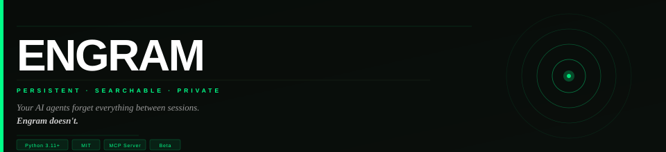

<p align="center"></p>

**Your AI agents forget everything between sessions. Engram fixes that.**

---

## The Problem

You're deep into a project with Claude Code or Cursor. The agent knows your architecture, knows the bug you spent two hours tracking down, knows you always use `RS256` for JWT and hate trailing commas. You close the tab. You open it again. The agent introduces the same bug. It suggests the same pattern you already rejected. It asks you to re-explain the same architecture decision for the third time.

Every session starts from a blank slate. The agent isn't getting worse — it's getting reset.

**Engram is the memory layer.** It runs alongside your AI tools and gives every agent a shared, persistent, searchable store of everything learned about your projects. Store a decision once; every future agent finds it. Fix a bug on Monday; Tuesday's agent already knows about it.

---

## What Makes Engram Different

Most "memory" solutions for AI tools are basic key-value stores — you save a note and it either matches exactly or it doesn't. Engram runs three search signals simultaneously:

**Keyword search (BM25)** — Full-text search. "SQLITE_BUSY timeout" matches "SQLITE_BUSY timeout." Fast and exact.

**Semantic vector search** — Matches by meaning, not words. Search for "database lock problem" and it finds the memory you stored about "WAL mode busy timeout" — no shared words, but the vectors are close. This requires an embedding model (Ollama or OpenAI, your choice). Without one, Engram falls back to BM25 only.

**Recency decay** — Recent memories score higher. The decision you made yesterday outweighs the one from six months ago. Nothing is deleted; things step back over time.

**Knowledge graph (enrichment)** — When you recall a memory about authentication, Engram traverses its graph connections and pulls in related memories automatically: the bug caused by the auth flow, the pattern you use to test it, the JWT library decision. You get the result plus its neighborhood in one call.

All four signals combine on every recall. You get useful results whether you remember the exact phrase you stored or only roughly what the problem was.

---

## What's Inside

Engram exposes tools that any MCP-compatible client — Cursor, Claude Code, VS Code, Windsurf — can call directly:

### Core Memory Operations

| Tool                   | What it does                                                            |
|------------------------|-------------------------------------------------------------------------|
| `memory_store`         | Save a memory — auto-chunks, embeds, and indexes it                     |
| `memory_store_batch`   | Store multiple memories in one efficient call with batched embedding     |
| `memory_recall`        | Search across keyword, semantic, and graph layers with a single query   |
| `memory_list`          | Browse recent memories, optionally filtered by type, tag, or importance |
| `memory_correct`       | Supersede a wrong or outdated memory with a corrected version           |
| `memory_forget`        | Delete a memory and all its graph connections                           |
| `memory_connect`       | Link two memories with a typed relationship                             |
| `memory_feedback`      | Tell the system which recall results were useful                        |
| `memory_consolidate`   | Deduplicate, decay weak connections, prune stale memories               |
| `memory_status`        | View stats: memory count, chunks, graph size, database size             |

### Data Portability

| Tool                   | What it does                                                            |
|------------------------|-------------------------------------------------------------------------|
| `memory_dump`          | Export all project memories as markdown files                           |
| `memory_ingest`        | Import markdown files as memories with a backup snapshot                |

### Built-in Onboarding

Engram also provides an MCP **prompt** called `onboarding`. Call it at the start of a session and the agent gets a project-specific guide: current memory count, project stats, and a workflow summary. Most useful when connecting to a project with zero memories and you want the agent to bootstrap context before touching anything.

---

## How Projects Work

Engram organizes memories by **project namespace**. Every tool accepts a `project` parameter. Memories stored in `project="my-web-app"` are invisible to `project="cli-tool"` — your Django app's database schema won't bleed into your Rust CLI agent's context.

One special namespace: `project="global"`. Use it for preferences that apply everywhere — code style, tooling conventions, infrastructure rules. Any agent on any project can recall from `global`.

Each project namespace is a separate notebook. They share the same server, but nothing crosses between them. `global` is the one notebook every agent can read.

---

## Architecture

<p align="center">
  
</p>

### The Three Search Signals

<p align="center">
  
</p>

When you call `memory_recall`, Engram runs three searches simultaneously and combines their scores:

**1. BM25 Keyword Search** — Full-text search using PostgreSQL's `tsvector` with Porter stemming. Store "Authentication uses RS256 JWT" and a search for "RS256" or "JWT auth" scores high here.

**2. Vector Semantic Search** — Each memory is split into chunks and each chunk is embedded into a vector. At recall time, your query is embedded too, and Engram finds chunks close in that space. Store "WAL mode busy timeout," search for "database lock contention" — no shared words, but the vectors match.

**3. Recency Decay** — Exponential decay at 1% per hour. A memory from today scores significantly higher than one from last month. Old memories stay; they just step back.

The final composite score:

```
composite = (vector × 0.50) + (bm25 × 0.35) + (recency × 0.15)
final     = composite × importance_multiplier
```

The knowledge graph doesn't affect scoring — it enriches the result. When a top-scoring memory returns, Engram traverses its graph connections up to two hops and attaches those neighbors. You get the scored result plus its context in one call.

**Importance multipliers:**

| Importance | Label    | Multiplier | When to use                                          |
|------------|----------|-----------|------------------------------------------------------|
| 0          | Critical | 2.0×      | Core preferences, system-wide decisions              |
| 1          | High     | 1.5×      | Key project decisions, frequently-needed patterns    |
| 2          | Medium   | 1.0×      | Most memories — the default                          |
| 3          | Low      | 0.8×      | Minor notes, temporary context                       |
| 4          | Trivial  | 0.6×      | Auto-pruned after 30 days if never accessed          |

Without vector embeddings configured, the weights redistribute: BM25 gets `0.85` and recency gets `0.15`. Recall still works — you just lose the semantic similarity layer.

---

## Memory Types

Six types let agents filter by context. The type determines how memories are organized and surfaced:

| Type           | Use it for                                        | Example                                                          |
|----------------|---------------------------------------------------|------------------------------------------------------------------|
| `decision`     | Choices made and the reasoning behind them        | "Chose PostgreSQL over MySQL — needed JSONB and array columns"   |
| `pattern`      | Recurring code or architecture patterns           | "All DB access goes through a Repository class, never raw SQL"   |
| `error`        | Bugs, gotchas, known failures, and their fixes    | "Port 3000 is taken on this server — always use 3001"            |
| `context`      | General project or environment facts              | "Running on Ubuntu 22.04, Python 3.11, deployed to K8s"          |
| `architecture` | System design, data flow, integrations            | "Auth: client → /api/login → JWT (RS256) → httpOnly cookie"      |
| `preference`   | User style and convention preferences             | "Always tabs, 120-char lines, no trailing commas"                |

---

## Embedding Options

Engram auto-detects the best available option at startup, or you can force a mode with `ENGRAM_EMBEDDER`:

| Mode       | Model                        | Dimensions | Quality     | Cost        | Privacy     |
|------------|------------------------------|------------|-------------|-------------|-------------|
| `openai`   | `text-embedding-3-small`     | 1536       | Highest     | ~$0.02/1M   | Cloud       |
| `ollama`   | `nomic-embed-text` (default) | 768        | Good        | Free        | Fully local |
| `none`     | —                            | —          | BM25 only   | Free        | Fully local |

**Auto-detect order:** Ollama (if reachable) → OpenAI (if `OPENAI_API_KEY` is set) → None.

**Model lock-in protection:** Once a project stores its first embedding, Engram records the model name and dimensions. If you switch models later, Engram refuses to mix incompatible vectors rather than silently corrupting search. To switch models: export with `memory_dump`, wipe the project, re-ingest.

**Ollama model is configurable:** Set `ENGRAM_OLLAMA_MODEL` to use any Ollama-compatible embedding model. Default is `nomic-embed-text`.

---

## Installation

Engram runs as three Docker services: **PostgreSQL** for storage, **Ollama** for local embedding inference, and **Engram** for the MCP server.

### Prerequisites

- Docker Engine 20.10+
- Docker Compose 2.0+
- 1 GB RAM minimum
- An Ollama instance, OpenAI API key, or nothing (BM25-only mode works without either)

### Quick Start

```bash
git clone https://github.com/shugav/engram.git
cd engram

# Copy the example config and edit it
cp .env.example .env
```

Open `.env` and set at minimum — the rest have working defaults:

```bash
POSTGRES_PASSWORD=a-strong-password-here

OLLAMA_URL=http://ollama:11434          # Docker service (default)
# OLLAMA_URL=http://host.docker.internal:11434  # Mac: native Ollama via brew
```

Then start:

```bash
docker compose up -d
```

Engram listens on `http://localhost:8788/sse`. Connect your IDE.

---

## Connecting Your IDE

### Claude Code

```bash
claude mcp add engram --transport sse http://localhost:8788/sse
```

If you set `ENGRAM_API_KEY`, add a header:

```bash
claude mcp add engram --transport sse http://localhost:8788/sse \
  --header "Authorization: Bearer your-api-key"
```

### Cursor / VS Code

Add to `~/.cursor/mcp.json` (or `.vscode/mcp.json`):

```json
{
  "mcpServers": {
    "engram": {
      "url": "http://localhost:8788/sse"
    }
  }
}
```

### Windsurf

Add to `~/.codeium/windsurf/mcp_config.json`:

```json
{
  "mcpServers": {
    "engram": {
      "serverUrl": "http://localhost:8788/sse"
    }
  }
}
```

### Claude Desktop

Add to `~/Library/Application Support/Claude/claude_desktop_config.json` (macOS) or `%APPDATA%\Claude\claude_desktop_config.json` (Windows):

```json
{
  "mcpServers": {
    "engram": {
      "command": "docker",
      "args": ["exec", "-i", "engram-app", "python", "-m", "engram"],
      "disabled": false
    }
  }
}
```

---

## Configuration Reference

Create `.env` in the engram directory. All variables have working defaults — change only what you need:

```bash
# .env

# === Database ===
POSTGRES_PASSWORD=change-me-in-production   # Default: engram (please change this)

# === Embeddings ===
ENGRAM_EMBEDDER=ollama                      # Force mode: openai, ollama, or none
                                            # Default: auto-detect

OLLAMA_URL=http://localhost:11434           # Your Ollama endpoint
OLLAMA_API_KEY=sk-...                       # Only needed if your Ollama is behind auth
ENGRAM_OLLAMA_MODEL=nomic-embed-text        # Any Ollama embedding model. Default: nomic-embed-text

OPENAI_API_KEY=sk-...                       # Required if ENGRAM_EMBEDDER=openai

# === Server ===
ENGRAM_PORT=8788                            # HTTP port. Default: 8788
ENGRAM_API_KEY=your-secret-token           # Optional: require Bearer auth on the endpoint

# === Project ===
ENGRAM_PROJECT=default                      # Default project namespace
```

Full reference:

| Variable              | Default          | What it does                                               |
|-----------------------|------------------|------------------------------------------------------------|
| `POSTGRES_PASSWORD`   | `engram`         | PostgreSQL password. **Change this.**                      |
| `DATABASE_URL`        | *(set by Docker)*| PostgreSQL connection string. Set automatically by Compose.|
| `ENGRAM_EMBEDDER`     | *(auto-detect)*  | Force embedding mode: `openai`, `ollama`, or `none`        |
| `OPENAI_API_KEY`      | *(unset)*        | OpenAI key for `text-embedding-3-small`                    |
| `OLLAMA_URL`          | `http://localhost:11434` | Ollama endpoint                                   |
| `OLLAMA_API_KEY`      | *(unset)*        | Bearer auth if your Ollama endpoint requires it            |
| `ENGRAM_OLLAMA_MODEL` | `nomic-embed-text` | Embedding model name                                     |
| `ENGRAM_PROJECT`      | `default`        | Default project namespace                                  |
| `ENGRAM_API_KEY`      | *(unset)*        | Bearer token to secure the SSE endpoint                    |
| `ENGRAM_PORT`         | `8788`           | HTTP port for SSE server                                   |
| `ENGRAM_RATE_LIMIT`   | `100`            | Max `memory_store` calls per 60s per project               |

Restart after changing `.env`:

```bash
docker compose down && docker compose up -d
```

---

## How Agents Use Engram

Engram works best when agents follow a consistent session pattern:

### At the Start of Every Session

Before touching code, the agent recalls where things stand:

```python
# 1. Find out where the last agent left off
memory_recall("session handoff", project="my-app")

# 2. Get relevant context for today's work
memory_recall("authentication flow", project="my-app")

# 3. Check user preferences that apply everywhere
memory_recall("code style preferences", project="global")
```

The session handoff note is a structured summary the previous agent stored before finishing. It tells the current agent what was done, what's next, and what's blocked. You stop re-explaining the current state of the project.

### During Work

When the agent makes a decision, hits a bug, or spots a pattern:

```python
# Store an architectural decision
memory_store(
    content="Auth uses RS256 JWT. Tokens issued at /api/login, 24h expiry, stored in httpOnly cookie. Do not use localStorage.",
    memory_type="decision",
    tags="auth,security,jwt",
    importance=1,           # High — this should never get pruned
    project="my-app"
)

# Store a bug that burned you
memory_store(
    content="Port 3000 is taken by the metrics service on this host. Use 3001 for the dev server.",
    memory_type="error",
    tags="port,devserver,gotcha",
    importance=1,
    project="my-app"
)

# Link related memories
memory_connect(
    source_id="decision-id-here",
    target_id="error-id-here",
    rel_type="relates_to",
    project="my-app"
)
```

### At the End of Every Session

Before the agent stops, it stores a handoff note:

```python
memory_store(
    content="SESSION HANDOFF: Implemented OAuth2 login flow | NEXT: Add logout endpoint and token refresh | BLOCKED: Nothing | FILES CHANGED: src/auth/login.py, src/auth/middleware.py",
    memory_type="context",
    tags="session-handoff",
    importance=1,
    project="my-app"
)
```

The next agent — same tool tomorrow or a different IDE entirely — calls `memory_recall("session handoff")` and picks up where work stopped. No re-explanation, no re-discovery.

### After Recall, Give Feedback

```python
# After using recall results, tell Engram whether they were useful
memory_feedback(memory_ids="id1,id2", helpful=True, project="my-app")
```

Positive feedback reinforces graph connections; negative feedback weakens them. Over many sessions, the graph self-optimizes toward what actually surfaces useful results.

---

## The Install/Uninstall Story

Engram gives you full control over your data at every stage.

### Bringing Existing Docs Into Engram

If you have existing markdown documentation, ingest it directly:

```bash
engram ingest --project my-app --directory ~/docs
```

This:
1. Parses all `.md` files in the directory
2. Stores them as indexed, searchable memories
3. Creates a backup zip of your originals plus a memory snapshot at ingest time: `memory-backup-2026-03-25T10-15-30Z.zip`

If anything goes wrong, your originals are in the backup.

### Using Engram Day-to-Day

Agents recall from and store to your namespaced project. Switch between Claude Code, Cursor, or Windsurf — the context follows. Multiple agents on the same project share the same memory store.

### Exporting Your Data (Leaving Engram)

Export all memories as editable markdown files:

```bash
engram dump --project my-app --output ~/my-memories
```

You get a directory of `.md` files, each with YAML frontmatter:

```
my-memories/
  001-decision-abc123xy.md
  002-pattern-auth-def456uv.md
  003-architecture-ghi789st.md
  ...
```

Each file is editable, greppable, committable. You can:
- Check them into git as documentation
- Search with any tool (`grep`, `ripgrep`, Obsidian, anything)
- Edit or delete individual memories
- Move them to a different system
- Use them as starting documentation for a new project

**Your memories are yours.**

---

## Security

Engram stores data in PostgreSQL inside a Docker volume.

**Secure the SSE endpoint.** Without an API key, anyone on your network can read and write your memories. Set `ENGRAM_API_KEY` and clients must send `Authorization: Bearer <key>` with every request. Docker Compose binds to `127.0.0.1:8788` by default — only change this if you need remote access.

**For multi-machine access, use a mesh VPN.** Tailscale or WireGuard keeps traffic encrypted without a public endpoint. Bind Engram to your VPN IP with an API key — that's the right architecture for remote access.

**What Engram sends externally:**
- **Ollama embeddings:** Memory text goes to your Ollama endpoint. If Ollama runs as the bundled Docker service or locally on the same machine, it never leaves your host.
- **OpenAI embeddings:** Memory text goes to OpenAI's `text-embedding-3-small` API. Use `ENGRAM_EMBEDDER=ollama` or `ENGRAM_EMBEDDER=none` to keep everything local.
- **Nothing else.** No telemetry, no analytics, no callbacks.

For responsible disclosure of security issues, see [SECURITY.md](SECURITY.md).

---

## Backup & Recovery

**Your memories are valuable. Protect them.**

One rule of Docker volumes: **never run `docker compose down -v`**. The `-v` flag deletes the `pgdata` volume and your entire memory store. There is no undo.

Safe Docker operations:

| Command                          | Data safe? | Notes                                  |
|----------------------------------|------------|----------------------------------------|
| `docker compose restart`         | ✅ Yes     | Restart services — data untouched      |
| `docker compose up -d`           | ✅ Yes     | Start or update containers             |
| `docker compose down`            | ✅ Yes     | Stop containers, keep volumes          |
| `docker compose down -v`         | ❌ **DATA LOSS** | Deletes all volumes. **Never use.** |
| `docker volume rm engram_pgdata` | ❌ **DATA LOSS** | Same result. **Never use.**         |

### Creating Backups

Before any Docker maintenance:

```bash
# Dated PostgreSQL dump
docker compose exec -T postgres pg_dump -U engram -d engram | \
  gzip > backups/engram-$(date +%Y%m%d-%H%M%S).sql.gz

# Verify it was created
ls -lh backups/engram-*.sql.gz
```

Store backups outside the `engram/` directory: cloud storage, NAS, external drive.

### Restoring from Backup

```bash
# Restore from a PostgreSQL dump
gunzip < backups/engram-20260326-153014.sql.gz | \
  docker compose exec -T postgres psql -U engram -d engram

# Verify restoration
docker compose exec -T postgres psql -U engram -d engram \
  -c "SELECT COUNT(*) FROM memories;"
```

### Full Volume Backup

For a complete system snapshot, useful before major upgrades:

```bash
# Backup the entire pgdata volume
docker run --rm \
  -v engram_pgdata:/data \
  -v $(pwd)/backups:/backup \
  postgres:16-alpine tar czf /backup/pgdata-full-$(date +%Y%m%d).tar.gz /data

# Restore from volume backup
docker run --rm \
  -v engram_pgdata:/data \
  -v $(pwd)/backups:/backup \
  postgres:16-alpine tar xzf /backup/pgdata-full-20260326.tar.gz -C /
```

---

## Database Layout

Engram uses PostgreSQL with five tables. You'll rarely touch these directly, but the layout helps when debugging or writing queries:

| Table           | What's in it                                                           |
|-----------------|------------------------------------------------------------------------|
| `memories`      | Memory records: content, type, tags, importance, timestamps, flags     |
| `memory_fts`    | Generated `tsvector` column + GIN index for full-text search           |
| `chunks`        | Chunked text with embedding vectors stored as `bytea`                  |
| `relationships` | Typed directed graph edges with decay-capable strength values          |
| `project_meta`  | Per-project metadata: embedding model, dimensions, schema version      |

Everything lives in the `pgdata` Docker volume. Back it up accordingly.

---

## Knowledge Graph

You can explicitly connect memories with typed relationships:

| Relationship    | When to use it                                                       |
|-----------------|----------------------------------------------------------------------|
| `relates_to`    | Two memories are on the same topic — the default general connection  |
| `depends_on`    | Memory A only makes sense if you've read Memory B first              |
| `caused_by`     | This bug was caused by that architectural decision                   |
| `supersedes`    | This memory corrects/replaces the old one (used automatically by `memory_correct`) |
| `used_in`       | This pattern is used in that feature/file                            |
| `resolved_by`   | This error was fixed by that decision or pattern                     |

When you recall a memory, Engram traverses up to two hops of its connections and attaches them. Ask about the JWT bug; you also get the authentication architecture memory and the session handling pattern connected to it.

`memory_feedback` reinforces useful connections and weakens ones that aren't. The graph self-organizes based on what surfaces helpful results.

`memory_consolidate` runs three maintenance passes:
1. **Deduplication** — removes exact duplicate chunks
2. **Edge decay** — reduces strength of graph edges that are never reinforced (strength below 0.1 = pruned)
3. **Stale pruning** — removes importance-3 and importance-4 memories never accessed in the last 30 days

Run consolidation weekly or after large ingests.

---

## Known Limitations

**Single server per team.** Multiple developers share one Engram instance. It handles concurrent writes via PostgreSQL's connection pool, but there's no replication or sharding.

**Ollama is optional.** If your Ollama endpoint goes down, Engram falls back to BM25-only automatically. Set `ENGRAM_EMBEDDER=none` to skip embeddings entirely.

**Vector dimension lock.** Once a project records its first embedding, you can't switch models without exporting and re-ingesting. Mixing vectors from different models corrupts search silently — Engram refuses rather than allowing it.

**Scale ceiling around 100k memories.** Tested and performing well up to ~100k per project. For very large stores (1M+), you'd need connection pooling and query tuning beyond the default stack.

---

## Compatible Clients

Any MCP-compatible client works:

- [Claude Code](https://github.com/anthropics/claude-code)
- [Claude Desktop](https://claude.ai)
- [Cursor](https://cursor.sh)
- [VS Code](https://code.visualstudio.com/) (GitHub Copilot MCP support)
- [Windsurf](https://codeium.com/windsurf)
- Any client that speaks [Model Context Protocol](https://modelcontextprotocol.io/)

---

## CLI Reference

The `engram` command covers server and data management:

```bash
# Start the server (stdio mode — for local IDE integrations)
engram

# Start in SSE mode (for network access)
engram server --transport sse --host 127.0.0.1 --port 8788

# Start in streamable-http mode (recommended for network deployments)
engram server --transport streamable-http --host 127.0.0.1 --port 8788

# Export all memories from a project
engram dump --project my-app --output ./my-memories

# Import markdown files as memories
engram ingest --project my-app --directory ./docs
engram ingest --project my-app --directory ./docs --type architecture --importance 1
```

The Docker deployment runs SSE mode automatically. The CLI is most useful for `dump` and `ingest`, or running Engram locally without Docker.

---

## Contributing

Contributions welcome, including first-time contributors. See [CONTRIBUTING.md](CONTRIBUTING.md) for setup, conventions, and the test suite.

For security issues, see [SECURITY.md](SECURITY.md).

---

## License

MIT License. See [LICENSE](LICENSE).

---

> **Beta software.** Engram is under active development. APIs, storage format, and behavior may change between releases. See [LICENSE](LICENSE) for the full warranty disclaimer.

---

<sub>Engram was created by [shugav](https://github.com/shugav). Security review and documentation by [Peter Simmons](mailto:petersimmons@duck.com). README written with Claude (Anthropic).</sub>
