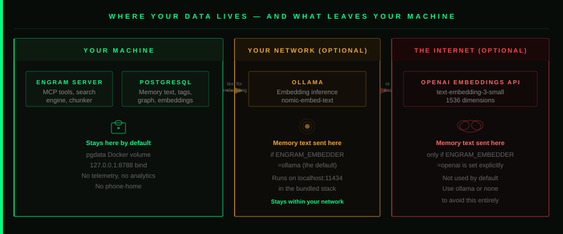

# Security Policy

Engram stores AI agent memory — decisions, patterns, bugs, architecture notes. Some of that is sensitive. This document explains what Engram stores, what leaves your machine, how to lock it down, and how to report a vulnerability if you find one.

---

<p align="center">
  
</p>

---

## What Engram Stores

Everything lives in PostgreSQL inside the `pgdata` Docker volume on your machine:

- **Memory text** — The content you or your agents store
- **Embedding vectors** — Opaque float arrays (768 or 1536 dimensions depending on your embedding provider); not human-readable
- **Knowledge graph** — Relationship metadata (source ID, target ID, type, strength); no content
- **Tags and metadata** — Types, importance levels, timestamps, project names

None of this is backed up to any remote service by default. No telemetry. No analytics. No phone-home. Engram has no registration, no license check, no usage reporting.

---

## What Leaves Your Machine

**Default setup (Ollama embeddings):** Memory text is sent to your Ollama endpoint for inference. The bundled Docker service runs on the same host, so nothing leaves your machine. If you point `OLLAMA_URL` at a remote Ollama instance, traffic stays within whatever network that host is on.

**If you use OpenAI embeddings (`ENGRAM_EMBEDDER=openai`):** Your memory text is sent to OpenAI's `text-embedding-3-small` API. The text leaves your machine and is processed by a third-party cloud service. OpenAI's [privacy policy](https://openai.com/policies/privacy-policy) governs this data.

**If you use `ENGRAM_EMBEDDER=none`:** Nothing leaves your machine. BM25 keyword search and the knowledge graph still work. You give up semantic similarity matching.

The diagram above shows exactly which path each configuration uses.

---

## Securing Your Deployment

### Set an API Key

Without an API key, anyone on your network who can reach port 8788 can read and write your memories. Set one:

```bash
# In .env
ENGRAM_API_KEY=generate-a-strong-random-token-here
```

Clients include it as a Bearer token: `Authorization: Bearer <key>`.

The Docker Compose file binds to `127.0.0.1:8788` by default, which limits access to your local machine. If you change the bind address to expose Engram on a network interface, set an API key first.

### Use TLS for Network Exposure

The API key travels over HTTP as a Bearer token. Without TLS, it's readable by anyone between the client and the server. If you expose Engram beyond localhost:

- Use a trusted mesh VPN (Tailscale, WireGuard) — this is the recommended approach. Your traffic stays encrypted and private without exposing a public endpoint.
- If you must use a public endpoint, terminate TLS with a reverse proxy (Caddy, Nginx) before the Bearer token crosses the wire.

Never expose the raw HTTP endpoint directly to the internet.

### Ollama URL Validation

Engram validates the Ollama URL before making requests to block [SSRF attacks](https://owasp.org/www-community/attacks/Server_Side_Request_Forgery_SSRF). It rejects:

- Cloud metadata endpoints (`metadata.google.internal`, `metadata.aws.internal`)
- Link-local addresses (`169.254.x.x`)
- Ports outside the allowlist (`80, 443, 11434, 8080, 3000, 8788`)

If you need a non-standard port for your Ollama setup, open an issue — the allowlist can be extended.

### Database Volume

The `pgdata` Docker volume is the authoritative store for all memory data. Protect it:

- **Never run `docker compose down -v`** — the `-v` flag deletes volumes and all data with them
- Back up the volume before major Docker operations (see the README Backup section)
- Restrict filesystem permissions on the Docker socket to trusted users

---

## Supported Versions

Security fixes are applied to the `main` branch. There are no versioned release channels yet — if you're running Engram, keep it on `main` and pull regularly.

| Branch / Version | Receives Security Fixes |
|------------------|------------------------|
| `main`           | ✅ Yes                  |
| Older forks      | ❌ Not maintained       |

---

## Reporting a Vulnerability

If you discover a security issue, please **do not post exploit details in a public issue**. This prevents the vulnerability from being weaponized before a fix is available.

**Preferred path:**

1. Go to the **Security** tab on the GitHub repository
2. Click **"Report a vulnerability"** to open a private GitHub Security Advisory
3. Include:
   - A clear description of the vulnerability
   - Reproduction steps or proof-of-concept code
   - Potential impact (what an attacker could achieve)
   - Suggested mitigation, if you have one

**If Security Advisories are unavailable:**

Open a regular issue with the title prefix `[SECURITY]` and include only enough detail to establish that a vulnerability exists. Request a private follow-up channel in the issue body. Maintainers will respond within 72 hours.

---

## Response Timeline

| Stage                              | Target                      |
|------------------------------------|-----------------------------|
| Acknowledgment of report           | Within 72 hours             |
| Initial severity triage            | Within 1 week               |
| Fix or mitigation plan published   | As soon as practical        |
| Public disclosure                  | After fix is available      |

**On responsible disclosure:** Please give maintainers reasonable time to investigate and patch before broad public disclosure. Coordinated disclosure benefits everyone — it means users can update before exploits become common knowledge.

If a fix is taking longer than expected and you need to disclose for legitimate reasons, please communicate with maintainers first. We will work with you.

---

## Known Security Boundaries

**Rate limiting:** `memory_store` is rate-limited to 100 calls per 60 seconds per project by default. This prevents runaway agents from filling your database. Adjust with `ENGRAM_RATE_LIMIT`.

**Content length:** Memory content is capped at 50,000 characters. Oversized content returns an error rather than partial processing.

**Immutable memories:** Memories stored with `immutable=True` cannot be corrected or deleted via the MCP tools. This protects critical preferences from accidental or malicious overwrites.

**Project isolation:** Each project namespace is fully isolated. An agent operating in `project="app-a"` cannot read memories from `project="app-b"`. Project names are sanitized to alphanumeric characters and hyphens.
