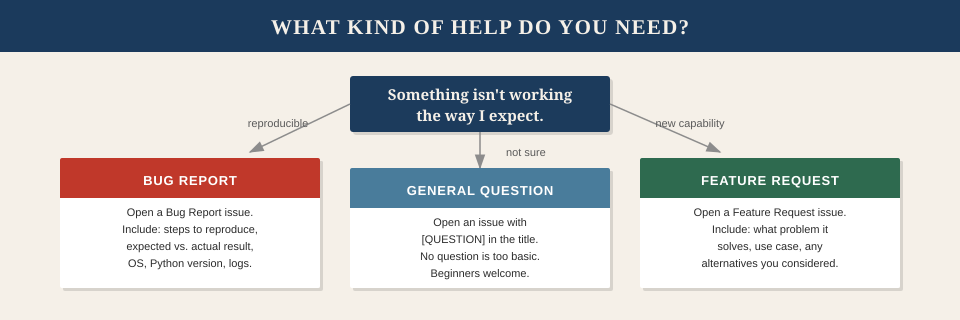

# Getting Help

Questions are welcome. There are no prerequisites for asking one. If you're new to MCP, new to Docker, new to AI tooling, or new to open source in general — you're in the right place and you're not expected to already know everything.

---

<p align="center">
  
</p>

---

## Where to Ask

All support happens through GitHub Issues. There's no mailing list, no Discord, no Slack. This keeps answers searchable — someone with the same question next month will find your thread.

**Bug:** Open a [Bug Report](https://github.com/shugav/engram/issues/new?template=bug_report.md) issue.

**Feature idea:** Open a [Feature Request](https://github.com/shugav/engram/issues/new?template=feature_request.md) issue.

**General question:** Open a plain issue with `[QUESTION]` in the title.

**Security issue:** Do *not* open a public issue. See [SECURITY.md](SECURITY.md) for the responsible disclosure process.

---

## Writing a Good Bug Report

The faster a maintainer can reproduce the problem, the faster they can fix it. The most useful bug reports include:

**What you were trying to do.** One sentence is fine. "I was trying to call `memory_recall` and filter by tag."

**What happened.** Paste the exact error message, output, or behavior. Don't paraphrase — the exact wording often matters.

**What you expected to happen.** Sometimes the bug is a missing feature; sometimes it's genuinely broken behavior. Stating your expectation makes it clear which.

**Your environment:**
- OS and version (Ubuntu 22.04, macOS 14.x, Windows 11)
- Python version (`python3 --version`)
- Engram version or commit hash (`git log --oneline -1`)
- MCP client (Claude Code, Cursor, VS Code, etc.) and its version
- Whether you're running Docker or local Python

**Logs.** Engram logs to stdout. To capture Docker logs:

```bash
docker compose logs engram
docker compose logs postgres
```

For more detail:

```bash
# Set log level to DEBUG for one run
docker compose run --rm -e ENGRAM_LOG_LEVEL=DEBUG engram
```

**What you already tried.** This prevents maintainers from suggesting things you've already ruled out.

**Redact secrets.** Before pasting logs or config, remove any API keys, passwords, or authentication tokens. Replace them with `[REDACTED]`.

---

## Writing a Good Feature Request

The best feature requests explain the *problem*, not the solution. "Add a `memory_search_by_date` tool" is harder to evaluate than "I can't find memories I stored last Tuesday — I'd like a way to filter recall results by time range." The second framing opens up a conversation about the right way to solve it.

Good feature requests include:

- **The problem:** What can't you currently do, or what's currently painful?
- **Who has this problem:** Is this specific to your setup, or likely to affect many users?
- **What you've tried:** How are you working around it today?
- **Alternatives you considered:** If you've already thought about other solutions, sharing them speeds up the discussion.

---

## Common Issues

Before opening an issue, check these first:

**Engram starts but my IDE can't connect:**
- Confirm Engram is running: `docker compose ps`
- Check the endpoint: `curl http://localhost:8788/sse` should return a streaming response header, not an error
- If you set `ENGRAM_API_KEY`, confirm your IDE config includes the `Authorization: Bearer <key>` header
- Check logs: `docker compose logs engram`

**`memory_recall` returns nothing (or irrelevant results):**
- Run `memory_status` to confirm memories are actually stored
- Check that you're using the same `project` name in both `memory_store` and `memory_recall`
- If semantic search should be working but isn't, check that your Ollama endpoint is reachable: `curl $OLLAMA_URL/api/tags`
- Try `ENGRAM_EMBEDDER=none` to verify BM25-only recall works — if it does, the embedding provider is the issue

**Embedding mismatch error:**
This happens when you switch embedding models on a project that already has vectors. The error message will name the stored model and the current model. Fix: export with `engram dump`, wipe the project, re-ingest with the new model.

**Docker volume data loss:**
If you accidentally ran `docker compose down -v`, check `~/.engram-archive/` for SQLite backups from before the PostgreSQL migration, and the `backups/` directory for any PostgreSQL dumps. See the README Backup & Recovery section for full restoration instructions.

**Ollama "model not found" warning:**
Engram auto-detects Ollama by checking `OLLAMA_URL/api/tags` for the `nomic-embed-text` model. If it's not listed, Engram falls back to BM25-only mode. To fix: `ollama pull nomic-embed-text` (or your configured model), then restart Engram.

---

## Response Style

Maintainers aim to be:

- **Practical** — actual solutions, not vague suggestions
- **Respectful** — no condescension for beginner questions
- **Honest** — if something isn't going to be fixed or accepted, you'll hear that directly rather than being strung along

If a response is unclear or doesn't solve your problem, follow up in the same thread. Asking follow-up questions is encouraged, not annoying.
